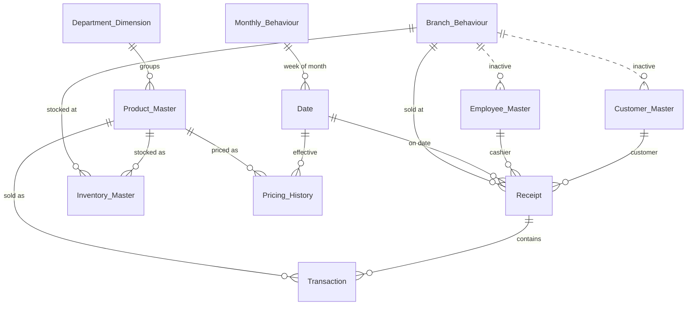

# JRAD Retail Superstore Dashboard

**A 6-page Power BI report built from raw, multi-table retail data: cleaning, star-schema modeling, DAX, and business insights.**


I took 12 source tables (1.8 million transaction lines) and turned them into an interactive dashboard that answers management questions about sales, products, customers, payments, and staff. Along the way I found and fixed real data problems, and where the data could not support a question, I documented that instead of inventing numbers.


<!-- Optional: add a short screen recording here once you have one
 -->

---

## At a glance

| | |
|---|---|
| **Tools** | Power BI (Power Query, DAX, data modeling) |
| **Dataset** | JRAD Retail Analytics Challenge 2026, a synthetic Nigerian supermarket dataset (5 branches, Jan to Dec 2026) |
| **Scale** | 1,807,529 transaction lines, 225,499 receipts, 632 products, 800 registered customers, 60 employees |
| **Output** | 6 interactive pages with slicers, page navigation, and dynamic insight text |
| **Currency** | Nigerian Naira (₦) |

**Revenue definition:** the sum of `Line_Total` (after discounts, VAT-inclusive). It reconciles exactly to payment amounts for all 225,499 receipts. Excluding VAT, revenue is ₦14.26bn.

---

## Key findings

1. **December drove the year.** Revenue reached ₦1.90bn (+39.1% vs November) while orders grew +22.2%. Average spend per visit rose +13.9%, so December's growth came from both more visits and larger baskets.
2. **Revenue is concentrated.** The top 126 products (20% of the 632-product catalog) generate ₦11.4bn, which is 74% of revenue. 107 products never sold.
3. **Three quarters of revenue is anonymous.** Walk-in traffic is 74.9% of revenue; the 800 registered customers account for 25.1%.
4. **Payment method barely changes spend.** Transfer is 60% of transactions, but average spend per visit is nearly identical across methods (₦67.4K to ₦68.5K).
5. **Cashier performance ratings don't track sales.** Across 40 cashiers, the correlation between rating and revenue is r = −0.01 (r = −0.04 for receipts handled).
6. **Egbeda leads every volume metric.** It has the most revenue, receipts, and units sold. Average spend per visit is nearly identical at Egbeda and Ikorodu (about ₦69.7K), roughly ₦3K above the other three branches.

---

## Data quality: what I found and fixed

| Problem | How it showed up | Resolution |
|---|---|---|
| **Branch names scrambled in the Employee table** | The same branch code (e.g. BR001) meant "Ajah" in four tables but "Oju Ore" in the employee table; all 60 employee rows were affected | Dropped the column and re-derived `Branch_Name` through a merge against one validated reference mapping |
| **Excel corrupted `Peak_Hours`** | 5 of 10 event rows had hour ranges (e.g. "20-09") auto-converted into dates; the original text was unrecoverable | Forced text type, nulled the 5 rows, and added a `Data_Quality_Flag` column instead of guessing the values |
| **Phone numbers lost their leading zero** | Stored as numbers, so 11-digit Nigerian numbers became 10 digits | Converted to text and restored the leading zero |
| **Ambiguous relationship paths (three separate times)** | Payments, Customer, and Employee tables each created a second route to Branch. Power BI refused to save, or silently returned unfiltered totals (a single-cashier lookup showed the company-wide ₦15.33bn instead of ₦437.2M) | Removed 4 duplicate columns from Payments; merged its `Amount` and `Payment_Status` into Receipt after confirming a strict 1:1 match (225,499 rows each, no orphans); deactivated the redundant Customer→Branch and Employee→Branch relationships |
| **Month-over-month growth of 1,046.8%** | The headline compared a full-year total against a single month; `DATEADD` shifts the entire active date range when no month is selected | Rebuilt with explicit year/month arithmetic anchored to the latest month *in the data* (not `TODAY()`, which would cut off months later than the current date) |
| **"Top" measures echoed the slicer** | Clicking a branch made "Top Branch" report that branch instead of the real leader | Wrapped the ranking in `ALL()` so it always ranks the full set |
| **Walk-in revenue swamped customer visuals** | 75% of revenue has no `Customer_ID`, so it collapsed into one blank group larger than every real customer | Filtered customer visuals to registered customers and reported walk-ins as receipts, not "customers" |
| **Phantom date fields** | Power BI's auto date/time created hidden hierarchies (and a wrong year) alongside my own Date table | Turned off auto date/time and used one marked Date table |

Before modeling, I also profiled every table for nulls, duplicates, orphan keys, and whitespace, and checked line-level arithmetic (`Line_Total = Unit_Price × Quantity − Discount + VAT`) and payment-to-transaction totals.

---

## Data model

The model uses a star-schema design: two fact tables at different grains (`Receipt` = one row per visit, `Transaction` = one row per line item) connected to shared dimensions. 14 relationships, 12 active and 2 deliberately inactive.



- **Date table:** built in DAX (365 rows), marked as the official Date Table, with month, quarter, weekday, and week-of-month columns and sort-by-column set up so months and weekdays display in calendar order.
- **Inactive relationships:** `Branch_Behaviour → Customer_Master` and `Branch_Behaviour → Employee_Master` stay inactive because each table already reaches Branch through `Receipt`. Keeping them (instead of deleting) leaves the option of activating them with `USERELATIONSHIP()` for "home branch" analysis.
- **Staging queries:** `Payments` and the folder-import query stay in Power Query with load disabled, so refresh still works without adding extra tables to the model.

---

## DAX highlights

Core measures (used consistently on every page):

```dax
Total Revenue = SUM('Transaction'[Line_Total])

Total Receipts = DISTINCTCOUNT(Receipt[Receipt_No])

Average Transaction Value = DIVIDE([Total Revenue], [Total Receipts])
```

Month-over-month growth that defaults to the latest month in the data and handles year boundaries:

```dax
Latest Month in Data =
CALCULATE(
    MAX('Date'[Year]) * 12 + MAX('Date'[Month Number]),
    FILTER(ALL('Date'), 'Date'[Date] <= MAX(Receipt[Transaction_Date]))
)

Total Revenue LM =
VAR SelectedYM =
    IF(
        HASONEVALUE('Date'[Year]) && HASONEVALUE('Date'[Month Number]),
        SELECTEDVALUE('Date'[Year]) * 12 + SELECTEDVALUE('Date'[Month Number])
    )
VAR AnchorYM = COALESCE(SelectedYM, [Latest Month in Data])
RETURN
    CALCULATE(
        [Total Revenue],
        FILTER(ALL('Date'), 'Date'[Year] * 12 + 'Date'[Month Number] = AnchorYM - 1)
    )

Total Revenue MoM Change % =
VAR SelectedYM =
    IF(
        HASONEVALUE('Date'[Year]) && HASONEVALUE('Date'[Month Number]),
        SELECTEDVALUE('Date'[Year]) * 12 + SELECTEDVALUE('Date'[Month Number])
    )
VAR AnchorYM = COALESCE(SelectedYM, [Latest Month in Data])
VAR Curr =
    CALCULATE(
        [Total Revenue],
        FILTER(ALL('Date'), 'Date'[Year] * 12 + 'Date'[Month Number] = AnchorYM)
    )
RETURN
    DIVIDE(Curr - [Total Revenue LM], [Total Revenue LM])
```

A ranking measure that stays correct when a slicer is applied:

```dax
Top Branch by Revenue =
VAR RankedBranches =
    ADDCOLUMNS(
        ALL(Branch_Behaviour[Branch_Name]),
        "@Rev", CALCULATE([Total Revenue])
    )
RETURN
    MAXX(TOPN(1, RankedBranches, [@Rev], DESC), Branch_Behaviour[Branch_Name])
```

Also in the model:
- A Pearson correlation measure (cashier revenue vs performance rating) that recalculates under any branch or month filter
- Narrative measures on the Executive, Payment, and Staff pages that rewrite their sentences as filters change
- A self-calculated revenue-tier classification (see Product Performance)

---

## Dashboard walkthrough

Six pages, moving from an executive summary into each functional area: **Overview → Sales → Products → Customers → Payments → Staff**. Every page follows the same structure: what the data shows, what it may mean, and what to investigate next.

### 1. Business Overview

KPI cards with month-over-month captions, revenue and orders trend, customer value mix, revenue by branch, revenue by department, top 10 products, and a dynamic Executive Insight paragraph.

| Metric | Value |
|---|---|
| Total Revenue | ₦15.33bn |
| Total Orders | 225,499 |
| Average Transaction Value | ₦67.99K |
| Total Quantity Sold | 3.58M units |
| Registered Customers | 800 |
| Active Products | 525 of 632 |

**Observed:** December was the strongest month (₦1.90bn). Revenue +39.1% vs orders +22.2%, units +35.2%, average transaction value +13.9%. The two busiest days were 19 Dec (1,598 receipts) and 26 Dec (1,560).
**Interpretation:** the December lift is broad-based (more visits *and* bigger baskets), consistent with holiday demand.
**Next question:** is the lift driven by specific products or branches, or is it a general seasonal effect?


### 2. Sales Performance

| Branch | Revenue | Receipts | Units sold | Avg spend per visit |
|---|---|---|---|---|
| Egbeda | ₦3.59bn | 51,546 | 829,655 | ₦69.7K |
| Ikorodu | ₦3.29bn | 47,251 | 760,271 | ₦69.7K |
| Oju Ore | ₦3.01bn | 45,108 | 710,901 | ₦66.7K |
| Abule Egba | ₦2.86bn | 42,959 | 674,495 | ₦66.6K |
| Ajah | ₦2.58bn | 38,635 | 605,060 | ₦66.7K |

**Observed:** branches rank identically on revenue, receipts, and units. Egbeda and Ikorodu are effectively tied on spend per visit (Ikorodu is higher by about ₦25) and both sit about ₦3K above the other three.
**Interpretation:** total revenue tracks traffic (receipts), not basket size, because spend per visit varies little across branches.
**Next question:** what separates the two higher-basket branches from the rest (product mix, customer mix, pricing)?


### 3. Product Performance

**Observed:**
- Rice is the top category (₦3.36bn across 31 rice products). The top single product is Borges Extra Virgin Olive Oil (₦873.5M), which sits in the Premium Cooking Oil category, so the two findings don't conflict: one is a category total, the other a single product.
- Groceries leads on volume and revenue (₦9.65bn, 1.44M units).
- Alcoholic Beverages sells the fewest units (about 30.7K) but earns the most per unit (about ₦14.6K). Dairy sells fewer units than Bakery yet earns 2.4× the revenue.
- **Revenue tier (self-calculated):** High = top 20% of the catalog (126 products, ₦11.4bn), Medium = next 30%, Low = the remaining products that sold. The 107 unsold products are excluded.

**Interpretation:** a small share of the catalog carries most of the revenue, which matters for stocking and promotion priorities.
**Next question:** are the 209 low-tier and 107 unsold products worth their shelf space?


### 4. Customer Revenue

**Observed:**
- Family Shopper is the top persona (₦8.1bn), then Premium Shopper (₦3.3bn) and Health Conscious (₦2.4bn).
- Registered and walk-in customers spend nearly the same per visit (₦68.4K vs ₦67.8K).
- By acquisition source, average revenue per customer runs from ₦4.55M (Banner) to ₦4.99M (Social), a narrow spread of about 10%.
- Weekly Grocery trips carry the largest baskets (21 items on average); Emergency Shopping the smallest (3).

**Interpretation:** the business depends on anonymous traffic it cannot track or target, and acquisition channel does not strongly separate customer value.
**Next question:** what would it take to convert walk-in shoppers into registered ones?


### 5. Payment Performance

| Method | Share of transactions | Revenue | Avg spend per visit |
|---|---|---|---|
| Transfer | 60.0% | ₦9.17bn (59.8%) | ₦67.7K |
| POS | 35.0% | ₦5.40bn (35.2%) | ₦68.5K |
| Cash | 5.0% | ₦0.76bn (5.0%) | ₦67.4K |

**Observed:** Transfer dominates; POS has the highest average spend but only by about 1 to 2%. Transfer revenue grew 39.1% in December vs November. Every payment in the dataset has status "Successful".
**Interpretation:** the payment mix by revenue mirrors the mix by transactions, so method choice doesn't change basket size. The 100% success rate is a property of this dataset (a single status value), not a measured result, so no failure analysis was possible.
**Next question:** is Transfer's dominance customer preference or a lack of alternatives at the till?


### 6. Staff Performance (Cashier & Employee)

**Observed:**
- 40 cashiers (8 per branch). Emeka Obi handled the most receipts (6,532, or 2.9% of total). Seyi Olawale generated the most revenue (₦457.9M, or 3.0%). Kingsley Obi has the highest average sale (about 6% above the team average).
- Egbeda has the heaviest workload (6.4K receipts per cashier) and the highest revenue per cashier (₦448.9M).
- Performance ratings range from 3.8 to 4.8 (mean 4.30) and show no relationship with revenue (r = −0.01) or receipts handled (r = −0.04).
- The other 20 employees (managers and supervisors) never appear in receipts by design; only cashiers operate the till.

**Interpretation:** "busiest", "highest earning", and "highest rated" are three different people, so the rating is not currently measuring sales output.
**Next question:** what does the performance score actually measure, and should it be weighted against revenue?


---

## Insights summary

| Area | Pattern | Why it matters |
|---|---|---|
| Revenue | Top 20% of products = 74% of revenue | Stocking and promotion should prioritize the high tier |
| Seasonality | December: revenue +39.1%, orders +22.2% | Demand planning should expect a strong year-end peak |
| Branches | Rankings are identical across revenue, receipts, and units | Growth is driven by traffic, so footfall matters more than basket size |
| Customers | 74.9% of revenue is from anonymous walk-ins | Revenue is hard to target or retain without registration |
| Payments | Mix by revenue equals mix by transactions | Channel choice doesn't change spend, but Transfer is a single point of dependency |
| Staff | Ratings are uncorrelated with sales | Performance reviews need a defined link to output |

---

## Data limitations and decisions

I chose to document gaps rather than fill them with invented numbers.

- **No cost data:** `Cost_Price_Jan` is empty for all 632 products, so the dashboard has no profit or margin metrics. I deliberately did not estimate them.
- **Popularity tier is empty in the source:** the tier on the Product page is my own revenue-rank classification and is labeled "self-calculated".
- **Loyalty membership is "Yes" for every customer:** a members-vs-non-members comparison isn't possible.
- **Payment status has a single value:** failure analysis isn't possible (see Payment Performance).
- **Walk-ins are anonymous:** they can be counted as receipts (169,244), not as people.
- **`Peak_Hours` unrecoverable for 5 events** (see Data quality).
- **Assumption:** `Monthly_Behaviour` is linked to the Date table through an assumed week-of-month bucketing (days 1 to 7, 8 to 14, 15 to 21, 22 onward); it is not used in the current visuals.
- **Scope:** inventory, pricing/inflation, and branch-behaviour/event analysis are not built. Those tables are loaded and cleaned for future work.
- **Sensitive attributes** (such as ethnicity in the customer table) were deliberately left out of all analysis.

---

## Data source and attribution

Dataset created by **Sodiq Basit Oluwatimileyin**, JRAD Retail Analytics Challenge 2026 (CC BY 4.0).

The data is synthetic, inspired by Nigerian supermarket operations. All figures are simulated and do not represent a real company's performance. The largest source file (`Transactions`, about 153 MB) exceeds GitHub's 100 MB per-file limit, so raw files are not included in this repository.

---

## What this project demonstrates

- Profiling and validating messy multi-table data before analysis (an instinct from my QA background)
- Building a relational model with correct cardinality, filter direction, and a proper Date table
- Diagnosing subtle DAX and relationship bugs by testing measures against independently calculated values
- Writing reusable, filter-safe measures instead of relying on implicit aggregations
- Separating what the data shows from what it might mean, and stating what it cannot support
- Designing a consistent multi-page report with navigation and dynamic narrative text

---

## Repository structure

```text
JRAD-Retail-Superstore/
├── README.md
├── jrad-superstore.pbix
├── assets/
│   └── images/
│       ├── jrad-overview.png
│       ├── jrad-sales-performance.png
│       ├── jrad-product-performance.png
│       ├── jrad-customer-revenue.png
│       ├── jrad-payment-performance.png
│       └── jrad-staff-performance.png
└── documentation/
    └── JRAD_Model_Build_Log.pdf
```

---

## Author

**Kolawole Opeyemi Oscar**, Quality Assurance Engineer moving into data analytics

- Portfolio: [oscarcodelab.github.io](https://oscarcodelab.github.io)
- LinkedIn: [kolawole-opeyemi](https://www.linkedin.com/in/kolawole-opeyemi-3063231b2)
- Email: KolawoleOpeyemiOscar@gmail.com
